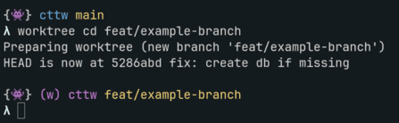

# Usage

```text
lfg [entrypoint]     (navigate to a worktree and start entrypoint, e.g. codex)
lfg --update         (update the lfg plugin to latest)
lfg --version        (show the installed lfg version)
lfg --help           (show this help)
```

- `entrypoint`: the command to run once inside the worktree. Defaults to `${LFG_DEFAULT_AGENT_COMMAND:-claude}`.

## Behavior

- Outside a git repo, `lfg` asks you to pick one from `$LFG_SOURCE_DIR` with `fzf`; the selector uses a rounded border labeled `Select a repo` around the `repo> ` prompt.
- Outside a git repo, `$LFG_SOURCE_DIR` should point to the folder that contains your cloned git repositories; it must exist and contain at least one immediate child repo with `.git`.
- When not already inside a linked worktree, `lfg` asks you to pick an existing worktree branch or type a new branch name to create one; the selector uses a rounded border labeled `Select or create worktree branch` around the `worktree> ` prompt.
- `lfg` appends `--color=pointer:<pointer-color>` to `FZF_DEFAULT_OPTS` for its `fzf` selectors so the selection pointer is colored by `LFG_FZF_POINTER_COLOR`.
- When `LFG_SMART_MODE` is set and `lfg` runs without an entrypoint argument, `lfg` discovers the available agent entrypoints from the entrypoint completion suggestions (keeping only commands found on `PATH`) and asks you to pick one with `fzf`; the selector uses a rounded border labeled `Select an agent` around the `agent> ` prompt. Passing an entrypoint explicitly (`lfg codex`) skips the picker. If no completion entrypoints are available on `PATH`, `lfg` prints an error instead of launching anything.
- If already inside a linked worktree, `lfg` launches the agent in the current directory.
- Otherwise, `lfg` creates or switches to the selected worktree through `worktree`, then launches the agent there.
- `lfg --help` prints usage with inline command descriptions, then exits without selecting a repo, entering a worktree, or launching an entrypoint.
- `lfg --update` downloads the installer and lets it install the latest GitHub release.
- Worktrees are created under `$LFG_SOURCE_DIR/.agents/worktrees/<repo>-<branch>/<repo>` (falling back to `$HOME/src` when `LFG_SOURCE_DIR` is unset) and reused by branch. Branch names are sanitized for directory names; `/` and other characters that are awkward in paths are replaced with `-`.
- If a `lfg_worktree_setup` function exists, `lfg` calls it with the worktree path before entering a worktree.

## Worktree Helper

The `worktree` helper manages branch-specific worktrees. `wt` is an alias for `worktree`.

```text
worktree                                 (pick branch/worktree interactively)
worktree add <branch>                    (create or switch to a worktree)
worktree cd <branch>                     (change to or create a worktree)
worktree list|ls                         (list worktrees)
worktree prune                           (remove missing, older than ${LFG_PRUNE_OLDER_THAN_DAYS:-7}d, or without remote branch)
worktree remove|rm <branch>              (remove a worktree)
worktree version                         (show the installed worktree version)
worktree help                            (show this help)
```

`cd` creates the worktree if it does not already exist.

## Worktree Conventions

- All `worktree` commands must be run from inside a git repository and operate on that repo only.
- Branch-related commands (`add`, `cd`, `remove`/`rm`) take a single `<branch>` argument.
- Repo-wide commands (`list`, `ls`, `prune`) take no arguments.
- Worktree paths replace `/` in branch names with `-`.
- When creating a new branch, `worktree` starts from `origin/HEAD`, then falls back to `main`, `origin/main`, `master`, `origin/master`, and finally `HEAD`.

## Pruning

`worktree prune` removes worktrees that are:

- missing their directory,
- older than `${LFG_PRUNE_OLDER_THAN_DAYS:-7}` day(s), or
- not backed by a remote branch.

Detached-HEAD worktrees are treated as having no remote branch and are also
pruned. After removals, it runs `git worktree prune` from the main checkout.

## Completion

Tab completion is available for `--help`, `--update`, `--version`, and
entrypoint completion suggestions. Fish and zsh completions include
descriptions for the built-in options. By default, entrypoint completion
suggestions use the bundled `completions/lfg.entrypoints` file.

Options:

- `--help`
- `--update`
- `--version`

Bundled entrypoint completions:

- `claude`
- `antigravity`
- `codex`
- `cursor`
- `kimi`
- `kimi-code`
- `opencode`
- `pi`
- `aider`
- `gemini`

Set `LFG_COMPLETIONS_FILE` to load entrypoint completion suggestions from
another file. The file is newline-delimited; blank lines and lines starting
with `#` are ignored. If the configured or bundled file is unreadable,
entrypoint completion is empty.

## Configuration

Configure `lfg` with environment variables.

| Variable | Default | Description |
|----------|---------|-------------|
| `LFG_DEFAULT_AGENT_COMMAND` | `claude` | Agent launched by `lfg` when no entrypoint is given. |
| `LFG_PRUNE_OLDER_THAN_DAYS` | `7` | Worktrees older than this many days are pruned. |
| `LFG_FZF_POINTER_COLOR` | `bright-blue` | Color for the fzf selection pointer. Passed as `pointer:<color>`. |
| `LFG_SOURCE_DIR` | `~/src` | Root directory scanned for repos when `lfg` is run outside a git repo. |
| `LFG_COMPLETIONS_FILE` | bundled `completions/lfg.entrypoints` | Newline-delimited file of `lfg` entrypoint completion suggestions. Blank lines and lines starting with `#` are ignored. |
| `LFG_SMART_MODE` | unset | When set, `lfg` without an entrypoint argument picks one interactively from the available agent entrypoints instead of using `LFG_DEFAULT_AGENT_COMMAND`. |

Set a different default agent:

```zsh
export LFG_DEFAULT_AGENT_COMMAND=codex
```

Pick the agent interactively on every bare `lfg`:

```zsh
export LFG_SMART_MODE=1
```

Scan a different source directory when launching outside a git repo:

```zsh
export LFG_SOURCE_DIR=~/Source
```

Keep worktrees longer before pruning:

```zsh
export LFG_PRUNE_OLDER_THAN_DAYS=7
```

Run custom setup before entering a worktree by defining `lfg_worktree_setup`
before sourcing `lfg`. The function receives the target worktree path as its
first argument. If it returns non-zero, `lfg` does not enter the worktree.

No-op hook for zsh or bash:

```bash
function lfg_worktree_setup() {
  # Optional: customize setup before lfg enters a worktree.
  :
}

source "$HOME/.local/share/lfg/lfg.zsh" # or lfg.bash
```

No-op hook for fish:

```fish
function lfg_worktree_setup
end
```

For fish, define this in `~/.config/fish/config.fish` or before sourcing
`/path/to/lfg/functions/lfg.fish`.

To keep the previous `mise trust` behavior, define the hook like this before
sourcing `lfg`:

```bash
function lfg_worktree_setup() {
  local worktree_path="$1"

  command -v mise >/dev/null 2>&1 || return 0

  if mise trust --show -C "$worktree_path" 2>/dev/null | grep -q ': untrusted'; then
    mise trust -y -q -C "$worktree_path"
  fi
}
```

Fish equivalent:

```fish
function lfg_worktree_setup
    set -l worktree_path $argv[1]

    if not command -v mise >/dev/null 2>&1
        return 0
    end

    if mise trust --show -C "$worktree_path" 2>/dev/null | string match -q '*: untrusted*'
        mise trust -y -q -C "$worktree_path"
    end
end
```

## Starship prompt

You can reference [my starship config](https://github.com/leoxlin/homebase/blob/main/starship/starship.toml) if
you'd like to use how I display worktrees within the shell prompt.


